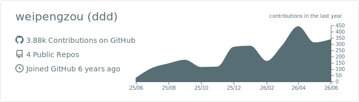
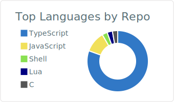
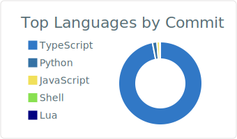
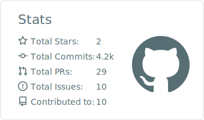
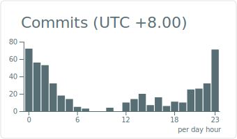

### Hi, Hi there, I am Ddd 👋

### Languages and Tools

 

---

### GitHub Stats

### Contribution Graph

### Profile Details (Contribution Heatmap)

### Repos per Language

### Most Commit Language

### Stats Summary

### Productive Time

